# Design

## Use case

In this paragraph, we gather the requirements from a business perspective before discussing how architectural patterns and software approaches can help build a product.

> Today, local grocery stores need to visit large distribution companies or call them one by one to check prices, stock availability, and delivery times in order to purchase merchandise.  
> This process consumes a lot of time and effort for grocery managers, which is why we want to address this pain point by building a platform where managers can check prices and stock levels, order merchandise, and monitor deliveries.

## Personas and User Journey

To build a system that addresses the right issues and adds real value, every part of the system should be designed with the users in mind. That's why it's crucial to understand them well, their frustrations, motivations, and expectations for this new product we are building.

* **Grocery Manager**
    * **Profile:** Typically has a bachelor's degree.
    * **Frustrations:** Running out of stock, lack of visibility over deliveries, price comparison is a time-consuming task.
    * **Motivations:** Save management time, focus on customer relationships and service quality, ensure stock levels are always adequate.

# Architecture & Design

In the previous section, we presented a brief overview of the business domain, requirements, and one of the system's future users. At this stage, we need to make architectural and design decisions.

## Architectural Style

While the brainstorming outputs are limited for this example, we can easily imagine different services: Order Service, Provider Service, Delivery Service, and Product Service.  
Now, imagine we want to build all these services in parallel, with different development teams specializing in different tech stacks. We want these services to remain decoupled from each other, so a change in one service's design doesn't impact the others.  
When it comes to **deployment**, we want to be able to deploy the __Product Service__ before the others to bring value as soon as possible. This implies that services should be deployable independently and scalable.

Also, by organizing our product around services, we can ensure fault tolerance. For instance, if the Delivery Service is down, users should still be able to use other services. For all these reasons, we are convinced that a **microservices architecture** is the right architectural style for this project.

## Domain Design 

The complexity of the business domain, the rules, and the number of services (system components) lead us to consider Domain-Driven Design (DDD). So, what is DDD?

:::info

DDD, as described in the excellent book *Domain-Driven Design* by Eric Evans (Addison-Wesley Professional, 2003), is an approach to building complex software applications that is centered around developing an object-oriented domain model.  
A domain model captures knowledge about a domain in a form that can be used to solve problems within that domain.

:::

In traditional object-oriented design, a domain model is a collection of interconnected classes. For example:

*Figure 1: Object Oriented Domain Model*

With this design,Performing operations like loading or deleting an Order object involves more than just the Order;
it includes related data like order items and delivery details. The lack of clear boundaries complicates updates, as business rules, like minimum order amounts, must be enforced carefully to maintain invariants.

This is where DDD can help, by using Aggregates
> An aggregate is a cluster of domain objects within a boundary that can be treated as a unit

Figure 2 shows a simplified version of the domain model aggregates. Designing domain model using the DDD Aggregate pattern recommand that aggregates match a set of rules:
    1. Reference only the aggregate root
    2. Inter-aggregate references must use primary keys
    3. One transaction creates or updates one aggregate

*Figure 2: Domain Model Aggregates Simplified*

# Implementation

Now that we have designed the domain model aggregates and the achitecture implementation view __Microservices__, let's dive into the architecture logical view __Hexagonal Architecture__ , please refer to this post to learn about
[Architecture Implementation view, Hexagonal option and why we adopt it](/blog/2021-10-17-software-architecture-logical-view.mdx#the-hexagonal-architecture-style)

----

## References:

* [Domain Driven Design](https://www.oreilly.com/library/view/domain-driven-design-tackling/0321125215/)
* [Microservies Patterns](https://www.manning.com/books/microservices-patterns)

---