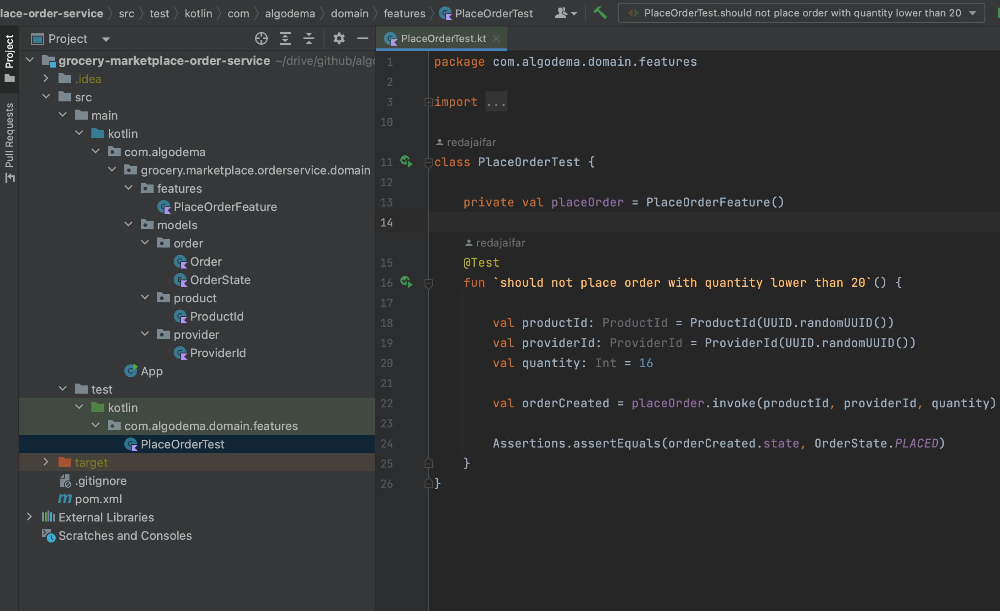
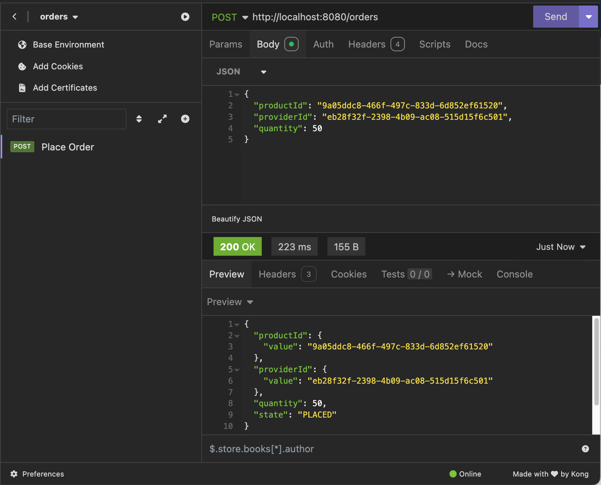

# Design

## Use case

In this phase, we begin by collecting requirements from a business perspective to ensure a thorough understanding of the objectives. Once these requirements are established, we then investigate how architectural patterns and software development methodologies can be utilized to construct the product effectively.

> Currently, local grocery stores must either visit large distribution companies or contact them individually to inquire about pricing, stock availability, and delivery schedules when placing orders. This process is time-consuming and inefficient for grocery managers.
> To address this challenge, we propose developing a platform that enables managers to easily check prices, view stock levels, place orders, and track deliveries in one streamlined solution.

## Personas and User Journey

To develop a system that effectively tackles the relevant challenges and provides significant value, it is imperative that every aspect of the system is designed with users in focus. This makes it vital to thoroughly understand their frustrations, motivations, and expectations regarding the new product we are creating

- **Grocery Manager**
  - **Profile:** Typically has a bachelor's degree.
  - **Frustrations:** Running out of stock, lack of visibility over deliveries, price comparison is a time-consuming task.
  - **Motivations:** Save management time, focus on customer relationships and service quality, ensure stock levels are always adequate.

# Architecture & Design

In the previous section, we presented a brief overview of the business domain, requirements, and one of the system's future users. At this stage, we need to make architectural and design decisions.

## Architectural Style

While the brainstorming outputs for this example are somewhat limited, we can easily envision various services, such as Order Service, Provider Service, Delivery Service, and Product Service. Now, suppose we want to develop all these services simultaneously, with different teams specializing in distinct technology stacks. It is essential that these services remain decoupled from one another, ensuring that a change in the design of one service does not affect the others.

Regarding deployment, we aim to deploy the Product Service before the others to deliver value as quickly as possible. This necessitates that the services be independently deployable and scalable.

By organizing our product around services, we can enhance fault tolerance. For example, if the Delivery Service is unavailable, users should still be able to access other services. For these reasons, we believe that a microservices architecture is the most suitable architectural style for this project.

Regarding deployment, we aim to deploy the Product Service before the others to deliver value as quickly as possible. This requires that services be independently deployable and scalable.

## Domain Design

The complexity of the business domain, the rules, and the number of services (system components) lead us to consider Domain-Driven Design (DDD). So, what is DDD?

:::info

DDD, as described in the excellent book _Domain-Driven Design_ by Eric Evans (Addison-Wesley Professional, 2003), is an approach to building complex software applications that is centered around developing an object-oriented domain model.  
A domain model captures knowledge about a domain in a form that can be used to solve problems within that domain.

:::

In traditional object-oriented design, a domain model is a collection of interconnected classes. For example:



_Figure 1: Object Oriented Domain Model_

With this design, operations such as loading or deleting an Order object encompass more than just the Order itself; they also involve related data, such as order items and delivery details. The absence of clear boundaries complicates updates, as business rules, imagine a business logic such as "minimum order amounts" must be enforced meticulously to preserve invariants

This is where DDD can help, by using Aggregates

> An aggregate is a cluster of domain objects within a boundary that can be treated as a unit

Figure 2 shows a simplified version of the domain model aggregates. Designing domain model using the DDD Aggregate pattern recommand that aggregates match a set of rules: 1. Reference only the aggregate root 2. Inter-aggregate references must use primary keys 3. One transaction creates or updates one aggregate



_Figure 2: Domain Model Aggregates Simplified_

# Implementation

Now that we have designed the domain model aggregates and the achitecture implementation view **Microservices**, let's dive into the architecture logical view **Hexagonal Architecture** , please refer to this post to learn about
[Architecture Implementation view, Hexagonal option and why we adopt it](/blog/2021-10-17-software-architecture-logical-view.mdx#the-hexagonal-architecture-style)

I'm going to use Kotlin as programming language and maven as a build tool

### Pilot feature

## Bootstrap the project

Let's consider the following feature: place order

> As a grocery manager, I need to place an order for a product so I can provision the stock
> Constraint 1: The minimum order quantity is 20.

Using maven build tool, let's create a project for kotlin.

    1. create a maven project using the following cmd:

    ```shell
        mvn archetype:generate \
        -DgroupId=com.algodema \
        -DartifactId=grocery-marketplace-order-service \
        -DarchetypeArtifactId=maven-archetype-quickstart \
        -DarchetypeVersion=1.4 \
        -DinteractiveMode=false
    ```

    2. convert the project to kotlin by replacing the src/main/java and src/test/java directories with src/main/kotlin
    3. modify pom.xml for Kotlin, JUnit, and AspectJ
    4. checkout the project on github: (https://github.com/algodema/microservices-labs/tree/main/grocery-marketplace-order-service)

## Implement the `place order` feature using TDD

What about starting with writing a test scenario for our uese case using TDD (Test Driven Development), this approach help me immediately implement business logic,
in this case ensure no order will be created with quantity less than 20 unit.

    ```Kotlin
        @Test
        fun `should not place order with quantity lower than 20`() {

            val productId: ProductId = ProductId(UUID.randomUUID())
            val providerId: ProviderId = ProviderId(UUID.randomUUID())
            val quantity: Int = 16

            val orderCreated = placeOrder.invoke(productId, providerId, quantity)

            Assertions.assertEquals(orderCreated.state, OrderState.PLACED)
        }
    ```

I started by creating "PlaceOrderFeatureTest" test class, then writing my first test as we see in the snippet above. If we look at the project structure in figure below:


:::note
Within the *domain* package, I created two sub-packages: *features* and *models*. The *models* sub-package includes representations of key domain entities, such as *Order*, *OrderId*, *ProductId*, and *OrderState*.
Meanwhile, the *features* sub-package contains feature-specific classes, with *PlaceOrderFeature* being the current implementation. It's important to note that in the *models* package, we organize classes according to their respective business domains.
:::

The approach involves declaring instances of `productId`, `providerId`, and `placeOrder` prior to the existence of their respective classes. Subsequently, these classes are developed and organized into packages in accordance with the principles of hexagonal architecture,
which positions business logic at the core, as represented by the domain package.

We continue writing tests, they should be fixed and failed as we implement the business requirements in our place order feature.

## Infrastructure implementation

Now that we created our first feature, we would like to expose it through a REST API endpoint, but also persist the created Order
in a storage, for the purpose of this tutorial, we will implement a **in-memory** persistence.

The hexagonal architecture defines ports and adapters as interfaces and implementations consequentially used to make the domain interacting and connecting with other components of the application such as (persistency, api, messaging, ...)

:::note

A **port** defines a set of operations that facilitate interaction between business logic and external systems.
In our Kotlin example, these ports are represented by Java/Kotlin interfaces.
An **adapter** manages requests from external sources or from the business logic itself by invoking external applications or services, such as databases or message brokers.
Both ports and adapters can be categorized as inbound or outbound to distinguish between requests directed toward the business logic and those initiated by it.

:::

:::info `Ports destination packages`

Ports will reside in the same root package as domain because they are integrated part of it. For our example: com.algodema.grocery.markeplace.domain.ports
As mentioned before, we separate them into 2 distinct sub packages:
    - com.algodema.grocery.markeplace.domain.ports.inbound
    - com.algodema.grocery.markeplace.domain.ports.outbound

Where adapters reside in the infrascture root package that we create to group all infrastcutures adapters such as:
    - REST API controllers classes
    - InMemory, Postgres or any other Repository implementations that serve to persist data.
    - External Systems integration such as SAPClient for example.

:::

Let's create the follwing ports and adapters:

    1. OrderRepository as an outbond port.
    2. PlaceOrder as inbound port.
    3. OrdersApi as inbound adapter that will use PlaceOrder port to expose the feature as REST API endpoint.
    4. InMemoryOrderRepostory as an outbound adapter that will implement the OrderRepository port interface.

Below we created the InMemoryOrderRepository class that implements the domain port OrderRepository interface, Note also that we annotate this class
with the Spring framework @Repository in order to make it discoverable by Spring IoC container. Remember that we use Spring at the infrastcuture level without any coupling with the domain.

```kotlin
    package com.algodema.grocery.marketplace.orderservice.infrastructure.spi

    import com.algodema.grocery.marketplace.orderservice.domain.models.order.Order
    import com.algodema.grocery.marketplace.orderservice.domain.ports.outbound.OrderRepository
    import org.springframework.stereotype.Repository

    @Repository
    open class InMemoryOrderRepository: OrderRepository {
        override fun save(order: Order): Order {
            throw NotImplementedError("not yet implemented")
        }
    }
```

Next, we will introduce the Spring framework at the infrastructure layer to create a REST API. We rely on the Spring framework's dependency injection to make our component connections decoupled.
Using Dependency Injection, the place order feature will hold an instance of OrderRepository to save the created order, and at the infrastructure's API adapter, the REST Controller will hold instances of our features by dependency injection as well.

:::note

This is where Hexagonal Architecture shines. We can replace Spring by any other framework for exposing REST APIs or handling persistence without modifying the code within our domain.
This decoupling keeps the domain safe, adaptable, and maintainable, allowing us to change or add new business rules independently of the infrastructure.
For example, if we decide to switch to the Quarkus framework because it is better suited for cloud-native environments, the domain remains completely unaffected.

:::

To enable Spring to identify our features for dependency injection, we will create a new root package designated as ddd. This package will encompass the necessary annotations:

    1. Feature Annotation: marks our features classes

```kotlin
    package com.algodema.grocery.marketplace.orderservice.ddd

    @Retention(AnnotationRetention.RUNTIME)
    annotation class Feature()
```


After creation, we utilize the Feature annotation to designate our **place order** functionality accordingly.

```Kotlin
    @Feature
    class PlaceOrder(private val repository: OrderRepository) : PlaceOrder {
        // ...
    }
```

:::tip

As previously noted, we will be utilizing Spring Boot for this project. Therefore, it is essential to incorporate the Spring Boot and Spring Web dependencies into our project, as well as to include the Spring Boot Maven plugin within the Maven build plugins.

:::

Let's create the OrdersApi in the infrastructure package under the sub package api, as follow:

```Kotlin
    package com.algodema.grocery.marketplace.orderservice.infrastructure.api

    import com.algodema.grocery.marketplace.orderservice.domain.features.PlaceOrder
    import com.algodema.grocery.marketplace.orderservice.domain.models.order.Order
    import com.algodema.grocery.marketplace.orderservice.domain.models.product.ProductId
    import com.algodema.grocery.marketplace.orderservice.domain.models.provider.ProviderId
    import org.springframework.web.bind.annotation.PostMapping
    import org.springframework.web.bind.annotation.RequestBody
    import org.springframework.web.bind.annotation.RequestMapping
    import org.springframework.web.bind.annotation.RestController

    @RestController
    @RequestMapping("/orders")
    class OrderServiceApi(private val placeOrder: PlaceOrder) {

        @PostMapping
        fun placeOrder(@RequestBody placeOrderRequest: PlaceOrderRequest): Order {

            val productId: ProductId = ProductId.from(placeOrderRequest.productId)
            val providerId: ProviderId = ProviderId.from(placeOrderRequest.providerId)
            val quantity: Int = placeOrderRequest.quantity

            return placeOrder.invoke(productId, providerId, quantity)
        }

    }
```

We now need to configure Spring to recognize our annotated features, enabling them to be loaded into its bean container.
To achieve this, we will create a configuration class within a subpackage named config under the infrastructure package. Below is our configuration class:

```Kotlin
    package com.algodema.grocery.marketplace.orderservice.infrastructure.config

    import com.algodema.grocery.marketplace.orderservice.ddd.Feature
    import org.springframework.context.annotation.ComponentScan
    import org.springframework.context.annotation.Configuration
    import org.springframework.context.annotation.FilterType

    @Configuration
    @ComponentScan(
        basePackages = ["com.algodema.grocery.marketplace.orderservice"],
        includeFilters = [ComponentScan.Filter(
            type = FilterType.ANNOTATION,
            value = [Feature::class]
        )]
    )
    open class DomainInjectionConfig
```

The final step is to transform our application's entry point class into a Spring Boot application as follows:

```Kotlin
    package com.algodema.grocery.marketplace.orderservice

    import org.springframework.boot.autoconfigure.SpringBootApplication
    import org.springframework.boot.runApplication


    @SpringBootApplication
    open class App

    fun main(args: Array<String>) {
        runApplication<App>(*args)
    }
```

You may have noticed the presence of the keyword "open" preceding the classes App, DomainInjectionConfig, and InMemoryOrderRepository. Here is the rationale behind this choice:

:::note
In Kotlin, classes are final by default, meaning they cannot be subclassed unless explicitly marked as open.
This is different from languages like Java, where classes are open for inheritance by default unless marked as final.

In Spring Boot (and Spring Framework in general), many of its features rely on proxy-based mechanisms. These mechanisms involve subclassing beans to apply aspects like transaction management, security, lazy initialization, and other cross-cutting concerns.
For these proxy-based features to work, Spring needs to be able to create subclasses of certain beans, which means the classes need to be open.
:::

For the purpose of this exercice we decided to use the **open** modifier to make our classes annotated with Spring not final as we have few classes,
but for large application we can use the [All-open compiler plugin](https://kotlinlang.org/docs/all-open-plugin.html) instead of preceeding each classe required to be open with the **open** keyword.

Finally, let's run the application either using your IDE such as Intellij Idea or from command line using maven as follow:

```shell
mvn spring-boot:run
```

Below a screenshot of the place order request response overview:



### Conclusion

This post has walked you through the entire process of building a fully functional Microservice, from design to implementation, using DDD and Hexagonal Architecture.
My goal was to share knowledge and experiences regarding the methodology, architecture, and patterns needed to create a maintainable, extensible, and deployable Microservice. However, delivering a production-ready product requires addressing more advanced aspects. Below is a non-exhaustive list of such considerations:

    * Api Errors Handling
    * Application security
    * Database persistency
    * Api documentation
    * Env variable config

Keep in mind that no single pattern, architectural style, or programming language suits all software product requirements. It's important to focus on understanding and defining the requirements, parameters, and challenges to make the most informed and effective decisions

---

## References:

- [Domain Driven Design](https://www.oreilly.com/library/view/domain-driven-design-tackling/0321125215/)
- [Microservies Patterns](https://www.manning.com/books/microservices-patterns)
- [Clean Code: A Handbook of Agile Software Craftsmanship by Robert C. Martin](https://www.oreilly.com/library/view/clean-code-a/9780136083238/)
- [Dependency Injection](https://docs.spring.io/spring-framework/reference/core/beans/dependencies/factory-collaborators.html)
- [The IoC Container](https://docs.spring.io/spring-framework/docs/3.2.x/spring-framework-reference/html/beans.html)
- [Software Architecture: The Logical View](https://algodema.com/blog/software-architecture-logical-view)
- [Software Architecture: The Implementation View](https://algodema.com/blog/software-architecture-implementation-view)

---
